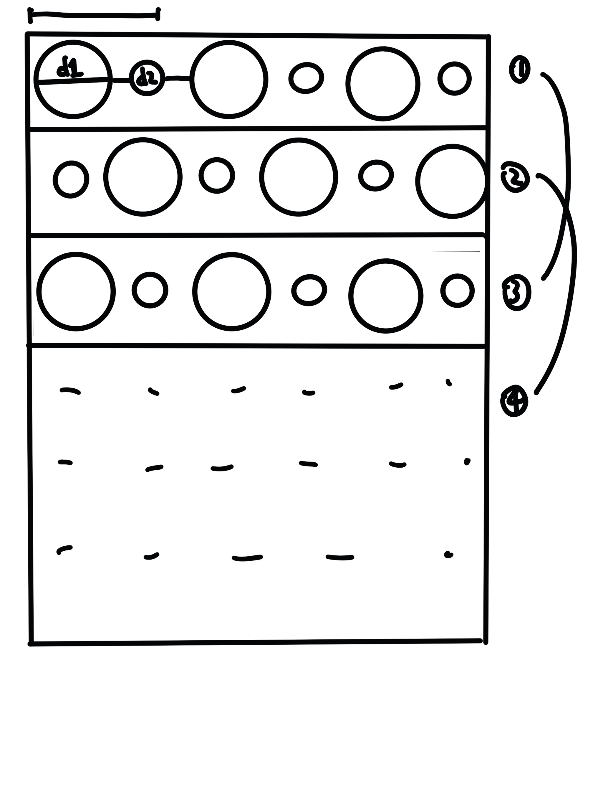
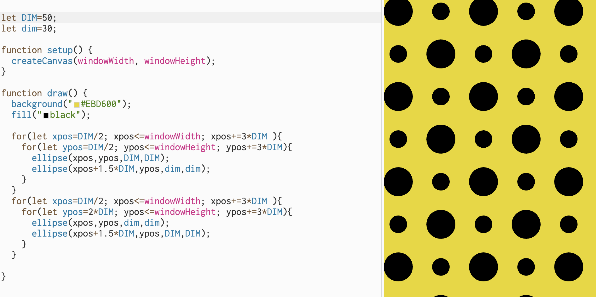

## Summary
This code is using nested for() loops, repeating to draw circles in two different sizes.

## Plan
First, I decide to draw the first line ellipses(a big one and a small one).Here is the sketch I did to clarify my next step.

I found the odd-numbered rows are all the same, and the even-numbered rows have smaller circles first and then larger circles, so I added if-else statement to define the row.

## Hard & Fun
I didn't use if-else statement at first, this is the first code I wrote. I didn't seperate them in odd/even rows, I drew them directly.

It is interesting to see the same result but using different methods. I think using if-else is more clear, and more convinent to draw complex patterns.